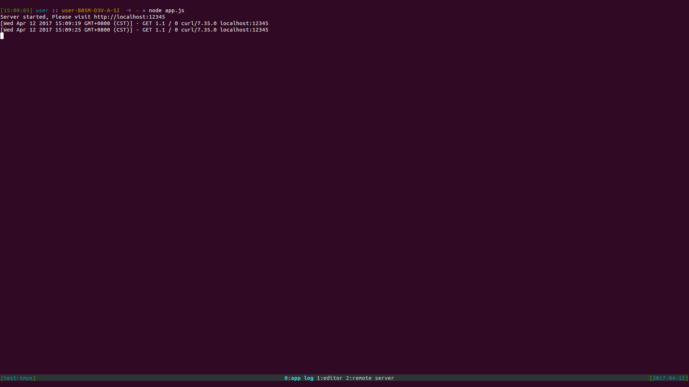
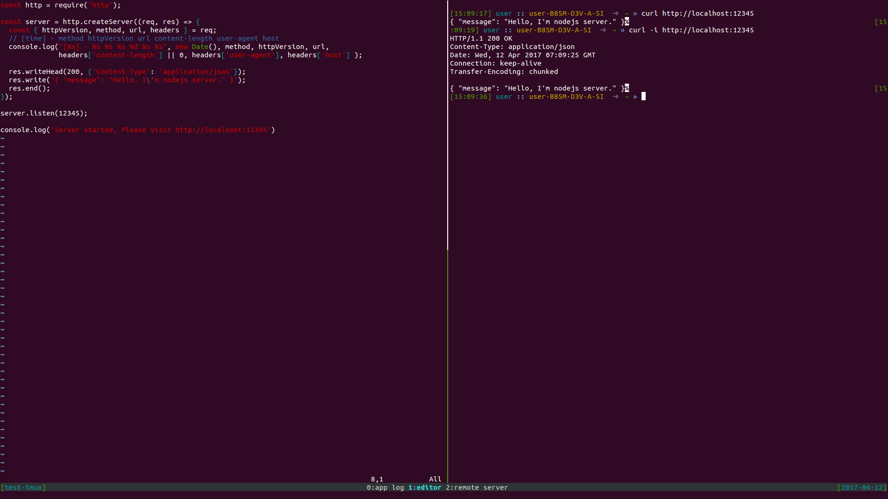

# tmux-conf
An simple and beautiful tmux configuration file.

## Config you tmux

1. Download `.tmux.conf` file.

```bash
$ git clone git@github.com:charleslxh/tmux-conf.git
```

2. Move `.tmux.conf` to `/home/user/`.

```bash
$ cd tmux-conf
$ mv .tmux.conf ~
```

## Start a tmux session

```bash
$ tmux new -s new-tmux-session
```

## Split a window

Press `Ctrl + prefix key`, then press `%`.

## Create a new window

Press `Ctrl + prefix key`, then press `c`.

## Use tmux tools.

- Tmuxinator: https://github.com/tmuxinator/tmuxinator

## Example



